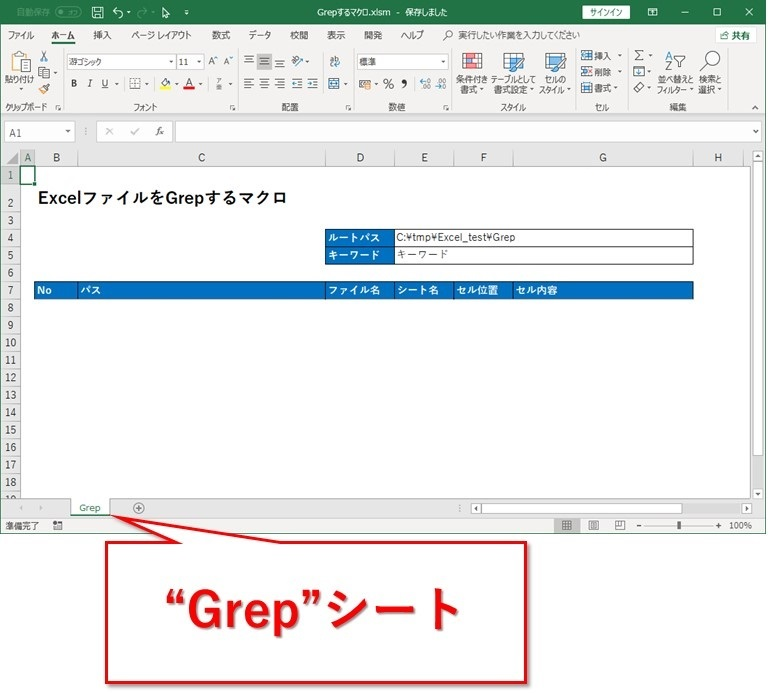

# ExcelGrepVBA

# 画面イメージ


# ソースコード
- 呼び出しボタン
```
Private Sub GrepButton_Click()
    Call grepMain
End Sub
```
- メイン関数
```
Option Explicit

Public Const STR_GREP_SHEET_NAME As String = "Grep"
Public sMsgString As String
Public sFilePathRoot As String
Public sKeyWord As String
Public lcnt As Long


'Grepメイン関数
Public Sub grepMain()
    Dim bErrFlag As Boolean
    bErrFlag = False
    
    sFilePathRoot = ThisWorkbook.Sheets(STR_GREP_SHEET_NAME).Cells(4, 5).Value
    sKeyWord = ThisWorkbook.Sheets(STR_GREP_SHEET_NAME).Cells(5, 5).Value

    'エラーチェック
    bErrFlag = inputCheck

    If bErrFlag = False Then

        '描画をいったんオフ
        Application.ScreenUpdating = False
    
        '一覧をクリア
        Call clearCells
    
        If Right(sFilePathRoot, 1) <> "\" Then
            sFilePathRoot = sFilePathRoot & "\"
        
        End If
    
        lcnt = 8
        
        'ExcelファイルのGrep
        Call openExcelFiles(sFilePathRoot)
        
        '罫線を引く
        Call addLines
        
        '描画をオン
        Application.ScreenUpdating = True
        
        sMsgString = "Grepが完了しました！！"
    
    End If
    
    'メッセージ出力
    MsgBox sMsgString
    
End Sub


'入力内容チェック
Private Function inputCheck() As Boolean
    inputCheck = False
    If sKeyWord = "" Then
        sMsgString = "キーワードが入力されていません"
        inputCheck = True
    End If
End Function


'指定したフォルダ内のエクセルファイルを全検索
Private Sub openExcelFiles(ByVal sFilePath As String)
    
    Dim lSheetNo As Long
    Dim sTmpPath As String
    Dim oFSO As Object
    
    If Right(sFilePath, 1) <> "\" Then
        sFilePath = sFilePath & "\"
    End If
    
    'Dirで見つかったファイル名を取得
    sTmpPath = Dir(sFilePath & "*.xls")
    
    '同じフォルダ内でエクセルファイルが見つかる限り検索
    Do While sTmpPath <> ""
        
        '読み取り専用、更新なしで開く
        Workbooks.Open sFilePath & sTmpPath, UpdateLinks:=0, ReadOnly:=1
        
            '全シートループ
            For lSheetNo = 1 To Worksheets.Count
            
                'シート内をGrep
                Call grepExcelSheet(sFilePath, sTmpPath, lSheetNo)
                
            Next lSheetNo
        
        Workbooks(sTmpPath).Close
        
        sTmpPath = Dir()
    
    Loop
    
    'この関数自身を呼び出して、サブフォルダも再帰的に検索
    With CreateObject("Scripting.FileSystemObject")
        For Each oFSO In .GetFolder(sFilePath).SubFolders
            Call openExcelFiles(oFSO.Path)
        Next oFSO
    End With
    
    Set oFSO = Nothing

End Sub

'Excelのシート内をGrep
Private Sub grepExcelSheet(ByVal sFilePath As String, ByVal sTmpPath As String, ByVal lSheetNo As Long)

    Dim lCellRow As Long, lCellCol As Long
    Dim rFoundCell As Range, rFoundFirstCell As Range
    Dim rEndRange As Range
    Dim rTmpFoundCell As Range
    Dim sTmpSheetName As String
    

    With Workbooks(sTmpPath).Sheets(lSheetNo)
        
        'シート内1件目に見つかったセルを取得
        Set rTmpFoundCell = .Cells.Find(What:=sKeyWord, LookAt:=xlPart)
        
        '見つからなかったら関数を抜ける
        If rTmpFoundCell Is Nothing Then Exit Sub
        
        'シート名を取得
        sTmpSheetName = .Name
        
        '最初に見つかったセル情報を保持
        Set rFoundFirstCell = rTmpFoundCell
        
        Do
        
            '見つかったセルの情報を一覧に記載
            Call outputCellInfo(sTmpPath, sFilePath, sTmpSheetName, rTmpFoundCell)
        
            'シート内2件目以降に一致したやつ
            Set rTmpFoundCell = .Cells.FindNext(rTmpFoundCell)
        
        '見つかったセルが最初に見つかったセルと異なる間ループ
        Loop While rTmpFoundCell <> rFoundFirstCell
    
    End With

End Sub


'キーワードを含むセルの情報をアウトプット
Private Sub outputCellInfo(ByVal sTmpPath As String, ByVal sFilePath As String, ByVal sTmpSheetName As String, _
                                                                            ByVal rFoundCell As Range)
                                                                            
    With ThisWorkbook.Sheets(STR_GREP_SHEET_NAME)
        
        'No
        .Cells(lcnt, 2).Value = lcnt - 7
        
        'パス
        .Cells(lcnt, 3).Value = sFilePath
        
        'ファイル名
        .Cells(lcnt, 4).Value = sTmpPath
        
        'シート名
        .Cells(lcnt, 5).Value = sTmpSheetName
        
        'セルの位置
        .Cells(lcnt, 6).Value = convertRange(rFoundCell.Column) & rFoundCell.Row
        
        'キーワードを含むセルの内容
        .Cells(lcnt, 7).Value = rFoundCell.Value
        
    End With

    '次の行に繰り上げる
    lcnt = lcnt + 1

End Sub


'セルの位置を変換
Private Function convertRange(ByVal lCol As Long) As String
    convertRange = ""
    
    Dim lTmpCol As Long
    Dim lBuf As Long
    Dim sAsc As Long
    sAsc = 64
    
    If Len(lCol) = 0 Then Exit Function
    
    lTmpCol = lCol
    
    '1桁目を変換
    lBuf = sAsc + lTmpCol Mod 26
        
    convertRange = Chr(lBuf)
    
    lTmpCol = lTmpCol \ 26
    
    '2桁目を変換
    If lTmpCol Mod 26 >= 1 Then
        
        lBuf = sAsc + lTmpCol Mod 26
        convertRange = Chr(lBuf) & convertRange
        
    End If
    
    '3桁目を変換
    If lTmpCol \ 26 >= 1 Then
    
        lBuf = sAsc + lTmpCol \ 26
        convertRange = Chr(lBuf) & convertRange
        
    End If

End Function


'罫線を引く
Private Sub addLines()
    
    Dim lRow As Long
    
    '8行目以降を選択
    lRow = ThisWorkbook.Sheets(STR_GREP_SHEET_NAME).Cells(Rows.Count, 2).End(xlUp).Row
    
    '0件の場合は罫線を引かない
    If lRow < 8 Then Exit Sub
    
    Range("B8:G" & lRow).Select
    
    '最初に通常の罫線を引く
    With Selection.Borders()
    
        .LineStyle = xlContinuous
        .Weight = xlThin
    
    End With
    
    '内側の横方向の罫線だけ点線にする
    With Selection.Borders(xlInsideHorizontal)
    
        .LineStyle = xlContinuous
        .Weight = xlHairline
    
    End With
    
    Range("A1").Select
    
End Sub

'セルをクリア
Private Sub clearCells()

    '7行以下ならクリアしない
    If ActiveCell.SpecialCells(xlLastCell).Row < 8 Then
        Exit Sub
    End If

    '8行目以降をクリア
    Range("B8", ActiveCell.SpecialCells(xlLastCell)).Select
    Selection.Borders().LineStyle = xlLineStyleNone
    Selection.ClearFormats
    Selection.ClearContents
    Range("A1").Select
        
End Sub
```

# 参考サイト
[VBAでExcelファイルをGrep検索するマクロを書いてみた | Website-Note](https://website-note.net/vba/excel-grep-macro/)
